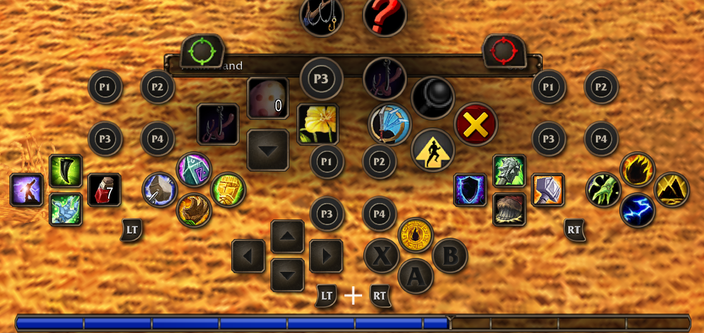

# PaddleSlots

Rear-paddle action panels for **WoW: Forever**, nested in the native gamepad crossbar. Built for the Xbox Elite Series 2; also works with the PlayStation DualSense Edge and any other controller whose extra buttons can be mapped to keys on PC.

Forever's crossbar gives you the d-pad and face buttons on four layers (no trigger, LT, RT, LT + RT). PaddleSlots adds a 2 x 2 group for the P1-P4 paddles to each layer: 16 more actions without taking your thumbs off the sticks. The panels use Blizzard's own crossbar art, expand and highlight exactly like the native bars, and sit next to the bar that uses the same trigger combination.

Built for **World of Warcraft: Forever** only (Interface 16001). It relies on Forever's native crossbar and gamepad API and does nothing on other clients.

## Quick start

1. Map each paddle to a key WoW does not use. Xbox Elite with the Xbox Accessories app: paddle to F9, F10, F11, F12. Steam Input or reWASD (Xbox Elite, DualSense Edge, others): paddle to F13, F14, F15, F16.
2. In game open **Settings > AddOns > PaddleSlots** (or type `/paddles`), click **Assign P1-P4** and press each paddle in turn.
3. Drag spells, items or macros onto the paddle slots. Hold LT, RT or both to fill the other layers.

Panels can be moved in WoW's normal Edit Mode, or with **Unlock panels outside Edit Mode** in the settings. `/paddles reset` puts them back into the crossbar.

## Settings

Open:

**Settings → AddOns → PaddleSlots**

or use:

`/paddles`

Options include:

- Unlock panels outside Edit Mode
- Only show in gamepad mode (panels hide in mouse-and-keyboard mode, stay visible while unlocked or in Edit Mode)
- Paddle inputs (one row per paddle, click to assign by pressing), Assign P1-P4, Setup guide
- HUD scale
- Inactive panel opacity (1.00 = native, no fading)
- Focus highlight and strength
- LT / RT modifier icons (off by default; the native crossbar shows the same prompts)
- Paddle prompts on the focused panel
- Diagnostics

## Paddle inputs

On Windows the Xbox Elite Series 2 does not report its paddles to games, and the DualSense Edge's back buttons arrive as copies of the face buttons. WoW only sees whatever the Xbox Accessories app, Steam Input or reWASD maps a paddle to, so PaddleSlots listens for a configurable input per paddle instead of assuming the native `PADPADDLE1-4` keys.

PaddleSlots never takes over a button the native gamepad UI uses. **Settings -> AddOns -> PaddleSlots -> Paddle inputs** shows one row per paddle whose button reads the current input; click it and press the paddle to assign a new one. Accepted inputs are only ones WoW does not use:

- physical keyboard keys with no WoW binding (F9-F12 on a compact keyboard; also F6-F8, Page Up/Down, Scroll Lock, Pause, or Numpad keys), for the Xbox Accessories app's keyboard key mapping,
- the Share button (unused by the native UI, if Xbox Accessories offers it for your controller),
- keyboard F13-F24, for Steam Input or reWASD sending keys that are not on the keyboard,
- the native paddle keys, for controllers that actually report paddles.

**Assign by pressing** opens a prompt and assigns each paddle to whatever the controller sends when you press it. If that is A, B, X, Y, a stick click, or any other native button, the prompt refuses it, explains that the controller profile is mirroring the paddle, and keeps waiting. Keyboard keys that already have a binding are refused too. **Setup guide** opens an in-game window with the step-by-step instructions for both routes and a live "last input detected" line.

Two routes:

1. **Xbox Accessories keyboard mapping**: map each paddle to a real key WoW leaves unbound (F9-F12 on a compact keyboard; also F6-F8, Page Up/Down, Scroll Lock, Pause, or Numpad keys), then use Assign by pressing. Share also works for one paddle if the app offers it.
2. **Steam Input or reWASD**: install Steam's Xbox Extended Feature Support driver (or use reWASD), map the paddles to F13-F16, leave them unassigned in Xbox Accessories, and select Keyboard F13-F16 in the addon. All four paddles work and the native layout stays intact. If a paddle press flips the UI to mouse-and-keyboard mode, pin the interface style to gamepad in the game's controls settings.

**PlayStation DualSense Edge**: Sony has no PC app for the Edge, and without a profile the back buttons and Fn buttons just repeat face buttons (Steam shows them as Circle and Cross, so the addon refuses them). Steam Input and reWASD do see the back buttons as their own inputs: add WoW as a non-Steam game, enable PlayStation controller support in Steam's controller settings, bind the two back buttons (and, if you like, the two Fn buttons) to F13-F16, and use route 2 above. A PS5 is not needed for this; the Edge's own profiles only matter if you also want them on the console.

The client's own default config for the Elite Series 2 (vendor 1118, product 767) maps raw buttons 16-19 to PADPADDLE1-4, but the controller never sends them on Windows. `/paddles test` shows raw presses; `/paddles learn` is only useful for controllers whose paddles arrive on other raw indices.

## Usage

Drag a spell, item, macro, or supported action-bar action onto any paddle slot. Press P1-P4 to activate the corresponding action in the currently active controller layer.

## Slash commands

- `/paddles` — open native PaddleSlots settings.
- `/paddles unlock` — move panels outside WoW Edit Mode.
- `/paddles lock` — lock panels outside WoW Edit Mode.
- `/paddles reset` — reset all four panel positions to the nested crossbar layout.
- `/paddles reset <base|lt|rt|both>` — reset one panel.
- `/paddles clear <base|lt|rt|both> <1-4>` — clear one paddle action.
- `/paddles guide` — open the setup guide window.
- `/paddles assign [1-4]` — assign one paddle (or all four in order) by pressing it.
- `/paddles keys [P1 P2 P3 P4 | reset]` — show or set the paddle inputs, e.g. `/paddles keys F13 F14 F15 F16`.
- `/paddles diag` — print gamepad integration diagnostics, including the paddle inputs and which raw buttons carry PADPADDLE1-4.
- `/paddles test` — for 30 seconds, print the raw controller button index of anything you press and what the client maps it to. Use it to confirm the paddles reach WoW at all.
- `/paddles learn` — press P1, P2, P3, P4 in order. The addon writes a device config (vendor/product specific) through `C_GamePad.SetConfig` so those raw buttons become PADPADDLE1-4. The client stores it in `WTF/GamePadConfig_AddOns.json`. Learning refuses raw buttons the client already uses (A/B/X/Y, D-pad, ...), because a paddle arriving as one of those means the controller profile mirrors it, and rebinding it would take the button away from the native UI. `/paddles learn force` overrides that check. `/paddles learn cancel` aborts; `/paddles learn clear` deletes the addon's device config again (follow with `/reload`).
- `/paddles help` — print command help.

## Diagnostics

`/paddles diag` reports:

- native storage status and slots
- LT / RT bindings
- modifier-emulation CVars
- LT / RT mapped button indices and current values
- visual detection method and visual panel
- secure panel
- native style CVars and native art availability
- secure panel-driver mode
- Edit Mode integration state

The most useful lines when validating a Forever build are **Modifier CVars**, **Mapped state**, **Visual panel**, and **Secure panel**.

The full version history is in [CHANGELOG.md](CHANGELOG.md).
